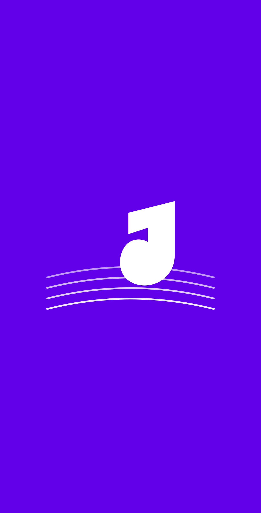
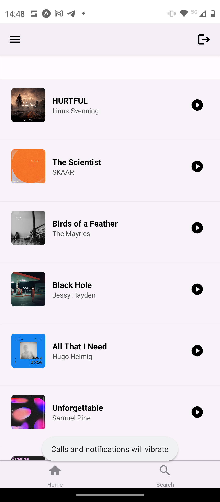
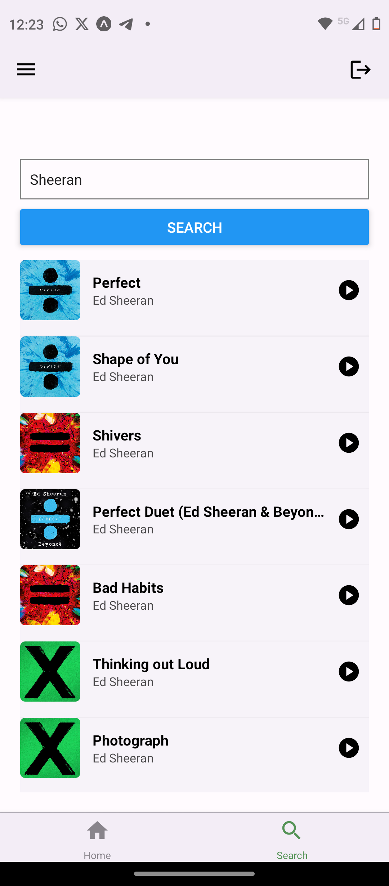
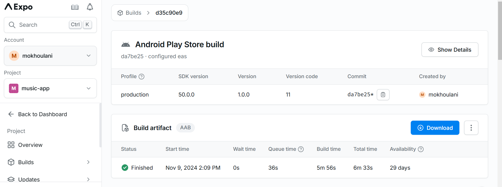

# Inlämningskrav för VG

## Inlämning

Lägg in den här filen i rooten av ditt projektet. Se sedan till att lägg till bilder andra filer som behövs i projektet också och uppdatera länkarna nedan i det här dokumentet.

När du är klar zippar du ihop projektet (utan node_modules) och lämnar in inlämningen på nytt i Google Classroom.

**OBS: Öppna den här filen som preview så du ser att dina länkar är rätt. Om bilder inte visas så kommer VG kompletteringen inte att godkännas.**

## Förbered appen

Utöver det som ska anges i den här filen så ska du även lägga till en appikon och en splashscreen i [app.json](./app.json) filen samt eventuella andra inställningar om du har använt dig av exempelvis kameran eller GPS'en, den informationen finns dokumenterad för respektive modul i Expo referensen.

**Det här måste göras innan du bygger appen.**

## Skyltfönstret i butiken & Bygga appen.

Nu kan du bygga appen med EAS och ladda hem filen när den är klar. Fyll sedan i nedanstående uppgifter som bevis på att du bara är några få steg ifrån att lansera din applikation på butiken.

**Applikationens Namn:** Music-App

**Kort Beskrivning (max 80):**
En app som ansluter till Spotify för att visa spellistor och låtar.

**Fullständig Beskrivning (max 4000):**

Music-App är en smidig musikspelare för Spotify-användare. Med denna app kan användaren:

- Logga in med sitt Spotify-konto och hämta sina senaste spellistor.
- Välja en spellista och visa alla låtar i den valda spellistan.
- Navigera till en detaljsida för varje spellista för att se och spela låtar.
- Se de 20 mest populära låtarna på Spotify direkt från hemsidan och spela dem.
- Söka efter artister och visa deras album och låtar, som även kan spelas direkt via Spotify.
- Besöka sin profilsida för att se användarinformation och hantera kontoinställningar.

Applikationens ikon och laddningsbild.
;
;
[Läs mer om dessa bilder här](https://docs.expo.dev/develop/user-interface/splash-screen-and-app-icon/).

En omslagsbild som visas på olika ställen i butiken.
;

Två till åtta fönsterbilder i formatet 16:9 eller 9:16 samt bredd och höjd mellan 320 och 3840 px.
;
;

[Binärfilen](./application-d35c90e9-d4fd-401e-b355-41317e1b6770.aab);
;
Tänk på att bilden måste visa både "Created By" och "Start Time".
